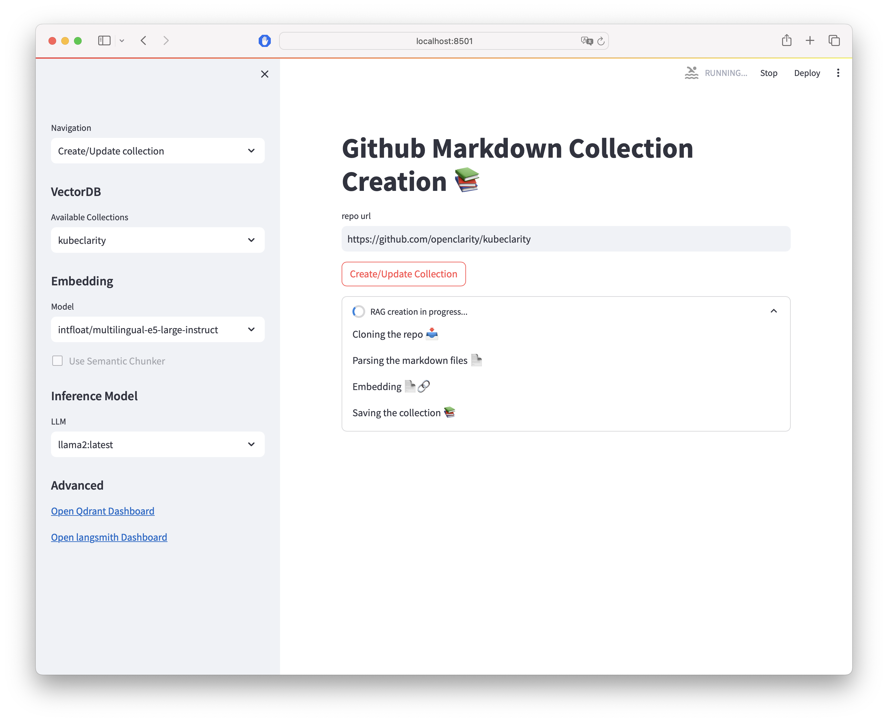
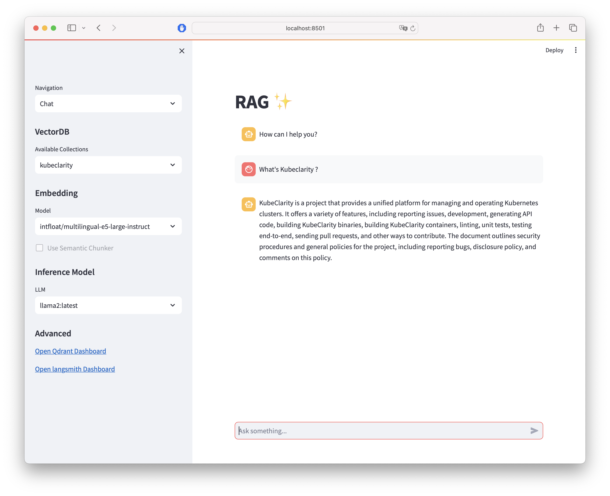
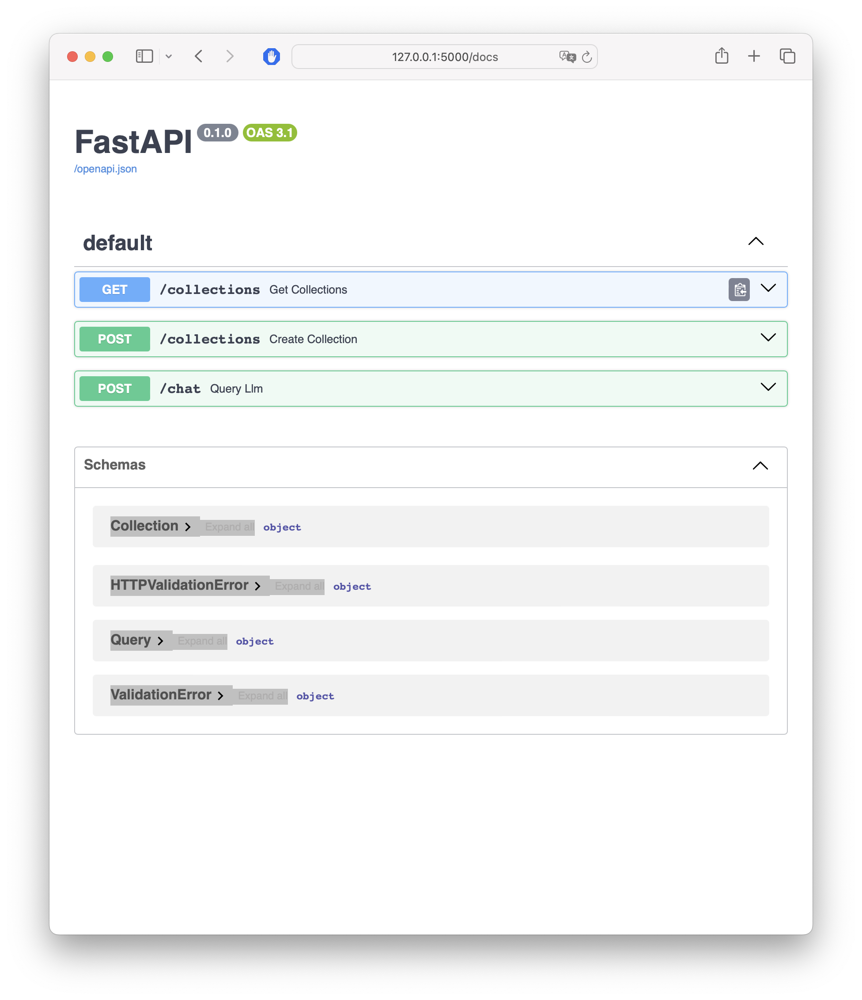

# RAG for Github

## Requirements
* Ollama
* Docker

## Instructions

0) [Recommended] Create a python virtual environment and activate it
   ```
   python -m venv rag-markdown
   source rag-markdown/activate
   ```

1) Install python requirements
   ```
   pip intall -r requirements.txt
   ```

2) Install Ollama following official installation instructions : [https://github.com/ollama/ollama](https://github.com/ollama/ollama)

3) Pull your required local LLM for example `llamae` or `mistral`
   ```
   ollama pull llama2
   ```

4) Copy/Edit `.env.template` as `api/.env` and `ui/.env` file with your OpenAI and LangSmith API key. [https://smith.langchain.com](https://smith.langchain.com)

4) Run Qdrant 
   ```
   docker run -dp 6333:6333 qdrant/qdrant
   ```

## UI

1) Start streamlit ui
   ```
   streamlit run ui/ui.py
   ```
2) Open Web browser to `http://localhost:8501`

3) Create a Collection from a github repository. You can select the embedding model you want to use. For the first time select `⬇️ Download a new model` and enter a [huggingface.io](https://huggingface.co) compatible model.
   

4) Interact with the newly created RAG. Navigate to `Chat` and select the collection you want to interact with. And the inference model from the drop down. If no inference model is available use the command `ollama pull <model name>` then refresh the page. Note : You must select the same embedding model used during Collection creation.
   

## API

1) Start API
   ```
   python api/api.py
   ```

2) Open Web browser to `http://localhost:5000/docs`
   
3) Interact with the OpenAPI
   